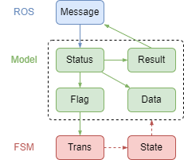

# auto_finite_state_machine

## Usage

add `AutoFiniteStateMachine.h` to your project, and `#include` it.

自动状态机，通过将函数与条件等注册至状态和转移的方式进行搭建，框架会进行转移判断、转移函数、状态出入函数和状态保持函数的全自动执行。

## 程序设计框架建议

有限状态机管理的ROS节点建议遵循下述框架。



如上图所示,程序分为三个主要部分：

1. ROS：节点间消息传递
1. 模型：消息、状态、数据、标识位和运算结果的处理和保存
1. 有限状态机：控制模型对上述数据进行处理

上述内容中，ROS和有限状态机无需设计，分别使用ROS官方的消息与节点构建流程和本项目有限状态机注册流程。对于模型，有以下几点建议：

1. 模型应该定义为一个类，类内保存有：
    - 变量：`消息变量`、`状态变量`、`数据变量`、`标识位变量`、`结果变量`
    - 函数：`消息订阅回调函数`、`数据处理函数`和`状态机函数`。
1. 模型内的四类变量分别负责：
    - `消息变量`：负责在每一帧同步所有收到的消息，一般直接使用ROS对应消息类型，由回调函数进行赋值。消息来自其他节点（指令或传感器数据），能够真实反应实体当前的状态。
    - `状态变量`：负责在被需要使用时，直接使用或与消息变量同步后使用，通常代表了实体上一帧或当前状态。
    - `数据变量`：负责按照程序设定对各类变量进行读取或记录，例如历史数据、预读取数据等。
    - `标识位变量`：负责对程序状态进行总结，以便状态转移判断函数直接使用。或者在帧之间传递判断依据或数据（类似数据变量，只不过是临时数据）
    - `结果变量`：负责向外传递程序处理结果，一般直接使用ROS对应消息类型，由发布者直接发布到对应节点。
1. 模型内的状态机函数包含`状态进入`、`状态保持`、`状态退出`函数，`转移判断`、`转移准备`、`转移前`、`转移后`函数。其中`状态保持`、`状态退出`和`转移判断`函数是必要的。它们的调用逻辑为：

```python
当前状态.保持()
for 新状态 in 所有当前状态的后继状态: # 试转移
    转移 = 转移表(当前状态, 新状态)
    转移.准备()
    if 转移.判断() == True:
        转移.前()
        当前状态.退出()
        当前状态 = 新状态
        当前状态.进入()
        转移.后()
        break
```

> **提示**
>
> 1. 为不混淆真实含义，状态机设计了(转移前、状态退出)、(转移准备、转移判断)、(状态进入、转移后)等函数，然而，实际情况中，上述每对括号内函数对数据的操作是等价的，例如转移前函数和状态退出函数均会在对应的判断函数返回真后执行，两者仅有两者之间的执行顺序不同，其他完全等价。
> 2. 另外，当前状态的保持函数执行完毕，会依次执行各个转移的准备函数，对于简单状态机而言，这两种函数也是类似的。但在复杂状态机中，建议把总结标识位变量的代码放入对应转移准备函数当中，如此一来，当一个转移标识位通过，则跳过了其他准备函数，可以减少状态保持函数的代码量和计算量。
> 3. 这又引发了另外的问题，即在转移准备函数当中的标识位变量不能每一帧都更新，所以建议不要同时用一个标识位变量在多个函数当中作为判断依据。
>
> **综上所述**：
>
> 1. 状态保持函数应当处理状态变量与消息的同步，一些打印操作，一些消息发送以及一些异常处理（空消息）等。
> 1. 转移准备函数应当对状态变量进行总结，存入标识位变量中。
> 1. 转移判断函数应当直接对对应转移准备函数总结的标识位进行是非或比较判断，返回一个bool值。
> 1. 转移前函数可以对标识位进行重新初始化。
> 1. 当前状态退出函数一般可以对标识位进行重新初始化、打印、发送指令等。
> 1. 当前状态进入函数一般可以对标识位进行重新初始化、打印、发送指令等。
> 1. 转移后函数可以对标识位进行重新初始化。
